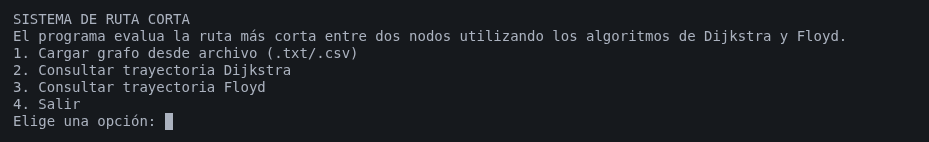
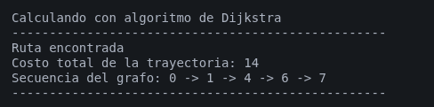

# Motor Algorítmico de Rutas Más Cortas (Dijkstra y FloydWarshall)

Aplicación de consola desarrollada en Java que resuelve el problema del camino más corto en la teoría de grafos. El sistema permite evaluar redes de nodos utilizando los algoritmos de Dijkstra y Floyd-Warshall, calculando tanto el costo mínimo acumulado como la secuencia exacta de la trayectoria. 

## Características
* **Carga de Grafos:** Capacidad para procesar topologías de red desde archivos `.txt` o `.csv`, interpretando el origen, destino y peso de las aristas.
* **Auto-descubrimiento de Archivos:** Escaneo automático de la carpeta `grafos/` para facilitar al usuario la selección de archivos de prueba sin teclear rutas manuales.
* **Procesamiento Dual:** Implementación matemática nativa de los algoritmos de Dijkstra y Floyd-Warshall.
* **Arquitectura Limpia:** Diseño modular por capas (Models, Services, UI) que aísla la lógica matemática, protegiendo las estructuras de datos (Matriz de Adyacencia).
* **Validación Robusta:** Captura de excepciones para archivos corruptos, letras en lugar de números y nodos fuera de rango.
* **Matriz de Adyacencia:** Estructura central de datos basada en arreglos nativos `[][]` que optimiza la memoria estática y facilita el acoplamiento limpio entre los distintos servicios algorítmicos.

## Requisitos Previos
Para compilar y ejecutar este proyecto, necesitas tener instalado el Java Development Kit (JDK) 21 (o superior). 
Puedes verificar si lo tienes instalado ejecutando en tu terminal:
```bash
java -version
javac -version
```

## Instalacion y Descarga
* **Abre tu terminal y clona este repositorio en tu máquina local usando Git:**
```bash
git clone
```
* **Navega hacia la carpeta del proyecto descargado:**
```bash
cd rutas-cortas-grafos
```

## Compilacion y Ejecucion
Dado que mi proyecto utiliza capas es estrictamente necesario compilar desde la carpeta src.

* **Posiciónate en la carpeta src:**
```bash
cd src
```
Copia el siguiente comando para compilar:
```bash
javac com/proyecto/grafos/Main.java
```
Ejecuta la aplicación (sin la extensión .java):
```bash
java com.proyecto.grafos.Main
```

## Ejemplos de uso

Al iniciar la aplicación, se mostrará un menú interactivo. Para probar la precisión de los algoritmos, utilizaremos un grafo complejo de 8 nodos.



Este repositorio incluye un directorio llamado **grafos/** que contiene grafos predeterminados para las pruebas, selecciona un archivo llamado **grafo_complejo_8_nodos.txt** dentro de la carpeta grafos/ (en la raíz del proyecto, un nivel atrás de src) con las siguientes conexiones (Origen, Destino, Peso).

El programa automaticamente busca en el directorio **grafos/**, dando la opcion de elegir en una lista con su indice, si no llegara a estar su grafo.txt puede seleccionar la opcion de ingresar la ruta manualmente.

### grafo_complejo_8_nodos.txt
```text
8
0,1,4
0,2,2
0,3,8
1,4,5
1,2,1
2,4,8
2,5,10
2,3,5
3,5,3
4,7,7
4,6,2
5,7,8
5,6,4
6,7,3
```

## Consulta de Trayectoria (Dijkstra o Floyd)


Intentaremos ir del Nodo 0 al Nodo 7. A simple vista, el camino directo parece el más viable, pero el algoritmo detectará que tomar desvíos con pesos menores resulta más económico.

* **Selecciona la Opción 1 y elige el archivo grafo_complejo.txt.**

* **Selecciona la Opción 2 (Dijkstra) o la Opción 3 (Floyd).**

* **Ingresa el Nodo Origen:** 0

* **Ingresa el Nodo Destino:** 7

**Salida Esperada:**
El sistema evaluará los costos y confirmará que la ruta más barata no es la de menos saltos, sino la de menor costo acumulado.



**(Nota: Si se solicita una ruta hacia un nodo aislado, el sistema indicará explícitamente que el destino es INALCANZABLE).**

## Arquitectura y Estructura del Proyecto

El sistema fue diseñado aplicando principios de separación de responsabilidades, organizando el código en las siguientes capas:

*  **/com.proyecto.grafos.models:** Estructuras de datos puras (Clase Grafo con matriz de adyacencia protegida y objeto DTO Trayectoria).

*  **/com.proyecto.grafos.services:**
 Contiene los motores algorítmicos (DijkstraService, FloydService) y el parseo/validación de datos (LectorGrafo), totalmente aislados de la lógica de interfaz.

*  **/com.proyecto.grafos.ui:** Capa de presentación y menús encargada de la interacción con el usuario (MenuConsola).

*  **/com.proyecto.grafos.Main:** Punto de entrada único del sistema.

## Tecnologías Utilizadas

* **Lenguaje:** Java 21

* **Paradigma:** Programación Orientada a Objetos.

* **Estructura Interna:** Matrices de adyacencia para garantizar tiempos de acceso constante.

## Autor

* **Sinuhe Alvarez Cortez:** Desarrollador Backend | Estudiante de Ingeniería en Computación

* **GitHub:** [ESPECTRO909](https://github.com/ESPECTRO909)

* **LinkedIn:** [Sinue Alvarez](https://www.linkedin.com/in/sinue-alvarez)