# Universidad Michoacana de San Nicolás de Hidalgo
---------------------------------------------------


### Programa de la carrera en Ingeniería en Computación

* **Materia:** Matematicas Discretas
* **Proyecto:** Ruta Corta
* **Alumno:** Sinuhe Fernando Alvarez Cortez
* **Fecha:** 14 de Junio de 2026


## 1. Introducción
Eate reporte detalla el diseño, análisis matemático y desarrollo de software de un motor algorítmico robusto construido en Java para resolver el problema del camino más corto dentro de una red de grafos. El objetivo central de la aplicación es procesar topologías complejas y determinar la trayectoria óptima entre un nodo origen y un destino específicos mediante el despliegue de dos de las lógicas más potentes de la teoría de grafos: el algoritmo de Dijkstra y el algoritmo de Floyd Warshall.

Aplicando principios de desarrollo, el proyecto descarta el uso de librerías externas y se enfoca en una arquitectura modular por capas tolerante a fallos. El sistema cuenta con mecanismos de validación de datos para las entradas de archivos físicos planos y un módulo de **auto descubrimiento** en directorios locales, optimizando la experiencia de usuario en consola.

---------------------------------------------------------
## 2. Justificación Técnica y Práctica

El desarrollo de este sistema de enrutamiento optimizado fue guiado bajo criterios estrictos de eficiencia computacional, encapsulamiento de datos y modelado aplicable a la ingeniería de software moderna.

**Justificación de las Estructuras de Datos:**
A nivel técnico, se seleccionó la **Matriz de Adyacencia** bidimensional como la estructura de datos primordial para representar la red. Aunque las listas de adyacencia ofrecen ventajas en el uso de memoria para grafos dispersos, el requerimiento explícito de implementar el algoritmo de Floyd Warshall requirio el uso de esta estructura en su diseño de manera estratégica. Floyd Warshall evalúa las conexiones de todos los pares de nodos posibles de forma iterativa cruzando caminos. Si operáramos sobre listas enlazadas dinámicas, buscar el costo de una conexión intermedia requeriría recorrer punteros, degradando drásticamente el rendimiento. Al utilizar una matriz indexada de tamaño N x N, tanto Dijkstra como Floyd obtienen lecturas y actualizaciones directas en memoria con un tiempo constante de O(1), garantizando una sincronización limpia entre ambos servicios algorítmicos.

-------------------------------------------------------------------
## 3. Fundamentos Matemáticos

El motor de procesamiento aloja dos metodologías matemáticas complementarias para auditar y resolver el grafo:

### Algoritmo de Dijkstra
El algoritmo de **Dijkstra**, también llamado algoritmo de caminos mínimos, es un algoritmo para la determinación del camino más corto, dado un vértice origen, hacia el resto de los vértices en un grafo que tiene pesos en cada arista. Su nombre alude a Edsger Dijkstra, científico de la computación de los Países Bajos que lo concibió en 1956 y lo publicó por primera vez en 1959.

La idea subyacente en este algoritmo consiste en ir explorando todos los caminos más cortos que parten del vértice origen y que llevan a todos los demás vértices; cuando se obtiene el camino más corto desde el vértice origen hasta el resto de los vértices que componen el grafo, el algoritmo se detiene. Se trata de una especialización de la búsqueda de costo uniforme y, como tal, no funciona en grafos con aristas de coste negativo (al elegir siempre el nodo con distancia menor, pueden quedar excluidos de la búsqueda nodos que en próximas iteraciones bajarían el costo general del camino al pasar por una arista con costo negativo).


### Algoritmo de Floyd Warshall
El algoritmo de **Floyd-Warshall** compara todos los posibles caminos a través del grafo entre cada par de vértices. El algoritmo es capaz de hacer esto con sólo V^3 comparaciones (esto es notable considerando que puede haber hasta V^2 aristas en el grafo, y que cada combinación de aristas se prueba). Lo hace mejorando paulatinamente una estimación del camino más corto entre dos vértices, hasta que se sabe que la estimación es óptima.

Sea un grafo **G** con conjunto de vértices **V**, numerados de 1 a N. Sea además una función caminoMinimo **( i , j , k )** que devuelve el camino mínimo de i a j usando únicamente los vértices de 1 a k como puntos intermedios en el camino. Ahora, dada esta función, nuestro objetivo es encontrar el camino mínimo desde cada i a cada j usando únicamente los vértices de 1 hasta k + 1 .

Hay dos candidatos para este camino: un camino mínimo, que utiliza únicamente los vértices del conjunto ( 1... k ); o bien existe un camino que va desde i hasta k + 1, y de k + 1 hasta j, que es mejor. Sabemos que el camino óptimo de i a j que únicamente utiliza los vértices de 1 hasta k está definido por caminoMinimo ( i , j , k ), y está claro que si hubiera un camino mejor de i a k + 1 a j, la longitud de este camino sería la concatenación del camino mínimo de i a k + 1 (utilizando vértices de ( 1... k ) y el camino mínimo de k + 1 a j (que también utiliza los vértices en ( 1... k ).

Por lo tanto, podemos definir caminoMinimo ( i , j , k ) de forma recursiva:
```bash
caminoMinimo ( i , j , k ) = min ( caminoMinimo ( i , j , k − 1 ) , caminoMinimo ( i , k , k − 1 ) + caminoMinimo ( k , j , k − 1 ) );

caminoMinimo ( i , j , 0 ) = pesoArista ( i , j ) ;
```

Esta fórmula es la base del algoritmo Floyd-Warshall. Funciona ejecutando primero caminoMinimo ( i , j , 1 ) para todos los pares ( i , j ), usándolos para después hallar caminoMinimo ( i , j , 2 ) para todos los pares ( i , j )... Este proceso continúa hasta que k = n, y habremos encontrado el camino más corto para todos los pares de vértices ( i , j ) usando algún vértice intermedio.

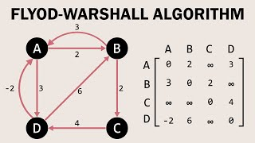


**Prevención del Desbordamiento Aritmético:**
Un aspecto matemático crítico implementado en el código fue la definición del valor numérico para representar el infinito (∞). El uso de la constante de sistema Integer.MAX_VALUE provocaría un desbordamiento de bits al sumar valores durante la relajación (distancia[u] + peso), convirtiendo el costo en un número negativo y destruyendo la lógica del programa. Se definió un infinito controlado de 99999999, que es lo suficientemente grande para denotar un nodo inalcanzable pero seguro para realizar operaciones aritméticas estables.

---------------------------------------------------
## 4. Decisión de Estructuras de Datos

Para cumplir con las métricas de buenas prácticas y modularidad, el sistema procesa la información utilizando colecciones y tipos de datos nativos:

* **Matriz de Adyacencia (int[][]):** Encapsulada dentro del modelo **Grafo.java**. Inicializa su diagonal principal en 0 (costo a sí mismo) y el resto de las celdas en INFINITO, garantizando limpieza de memoria antes de inyectar las aristas del archivo físico.

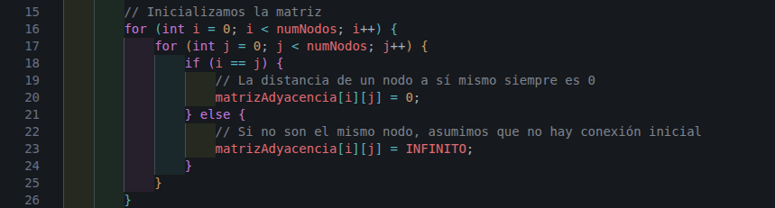

-----------------------------------------------
* **Vectores de Estado Local:** Durante la ejecución de Dijkstra, se instancian arreglos primitivos separados para aislar el cómputo: int[] distancias para los costos mínimos, boolean[] visitados para el marcado del conjunto permanente y int[] predecesores para rastrear la genealogía del camino en tiempo de ejecución.
-----------------------------------------------------
* **Objeto de Transferencia de Datos (Trayectoria.java):** Diseñado bajo el patrón DTO. Almacena un estado booleano de alcanzabilidad, un entero para el costo total y una estructura dinámica List<Integer> para la secuencia ordenada de nodos. Esto evita que las capas superiores tengan acceso directo a las matrices internas, protegiendo la integridad de la memoria.

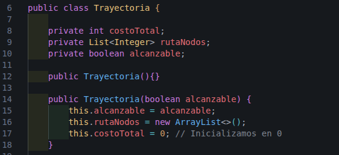

------------------------------------
## 5. Análisis de Complejidad

Cuando se necesita resolver un problema del mundo real es probable encontrar varias soluciones que permitan satisfacer las necesidades de éste. Por ello, también es probable encontrarse con un escenario en que haya soluciones más eficientes que otras y, en consecuencia, que su ejecución sea más rápida y sean mejores candidatas a ser desarrolladas e implementadas.

El análisis de algoritmos busca justamente resolver este escenario que se plantea determinando la eficiencia exacta de cada una de las posibles soluciones que puedan resolver el problema.

**Forma de determinar su eficiencia**

Una vez conocidos los dos tipos de complejidad existentes, hace falta conocer una forma única e inequívoca de poder determinar la complejidad para así poder comparar entre los diferentes algoritmos.

Antes, pero, es necesario precisar en base a qué se determinará la complejidad de un algoritmo y, concretamente depende de tres elementos: la cantidad de datos de entrada, el tipo de algoritmo que es y el computador que lo ejecuta.

El primero de todos se basa en la idea de que no es lo mismo tener que tratar una cantidad de datos pequeña como una cantidad muy grande. Por ejemplo, si hay que buscar un elemento entre un vector de 10 posiciones, en el peor de los casos solo habrá que recorrer 10 posiciones. Sin embargo, si el vector contiene 1000 posiciones, serán 1000. Por lo tanto, según la cantidad de datos de entrada el algoritmo tendrá una complejidad mayor o menor.

El segundo de ellos indica que un algoritmo tendrá mayor complejidad según las estructuras que tenga dentro. Por ejemplo, no es lo mismo ejecutar 10 líneas de código sin ninguna estructura iterativa dentro que hacerlo con un bucle donde esa cantidad de líneas se tendrá que ejecutar múltiples veces. Por lo tanto, según las estructuras que haya dentro del algoritmo, su complejidad será mayor o menor.

Finalmente, existe un último condicionante: el computador que lo ejecuta, ya que un mismo algoritmo con la misma cantidad de datos de entrada puede tardar más en un computador o en otro según los componentes que tenga. Además, también puede darse el caso que un algoritmo tarde un tiempo diferente en un mismo computador según el estado de este, ya que puede darse el caso en que ese computador esté usando gran parte del procesador en otra tarea y destine menos recursos a ejecutar el algoritmo. En cualquier caso, este elemento no suele tenerse mucho en cuenta a la hora de desarrollar un algoritmo, ya que en la mayoría de cosas, las diferencias sustanciales se encuentran en los dos primeros que se han explicado anteriormente.

Una vez definidos los elementos que determinan la complejidad, hay que tener en cuenta que un mismo algoritmo puede ejecutar diferente parte del código con estructuras condicionales o, incluso, no iterar siempre las mismas veces una estructura iterativa. Entonces, es necesario hablar de lo que se conoce como el peor caso. Este determina la situación en que se tendrán que ejecutar más líneas de código (o repetir más veces una estructura iterativa) y es el escenario en base a lo que se debe determinar la complejidad de un algoritmo.

Pero, ¿por qué hay que tener en cuenta este escenario para determinar su complejidad? La realidad es que, como ya se ha dicho, no siempre se ejecutarán la misma cantidad de líneas de un mismo algoritmo, como tampoco se van a tener que recorrer la misma cantidad de elementos de un vector en una búsqueda. Por ejemplo, si se parte del vector {1, 2, 3, 4, 5} y se busca el elemento con valor 1, parece claro que lo encontrará en la primera posición y no tendrá que seguir buscando. No obstante, esto es solo un caso concreto y, en la gran mayoría de los casos, el algoritmo no encontrará el valor deseado en la primera posición del vector.

Por lo tanto, es necesario generalizar este raciocinio para poder determinar la complejidad que tendrá un algoritmo en la mayoría de los casos. Siguiendo con el ejemplo propuesto, esta situación se dará cuando el elemento buscado no se encuentre dentro del vector, puesto que, en una situación real, será un caso bastante recurrente. Así pues, siempre que se quiera determinar la complejidad de un algoritmo, se tendrá que tener en cuenta el peor caso: que recorra todas las posiciones de un vector, que siempre se ejecuten los bloques condicionales de mayor complejidad, etc.

De este modo, habiendo citado todas las consideraciones previas, ya se puede empezar a determinar la complejidad temporal de forma exacta. Para ello, se establece un criterio donde se asigna una cantidad de tiempo a cada operación elemental que se realiza. De este modo, la suma de todas ellas determinará la complejidad temporal total.

En este caso, para facilitar el cálculo de la complejidad siempre se determina que todas las operaciones llamadas elementales tardan la misma cantidad de tiempo en ser ejecutadas. Normalmente, se suelen determinar con una constante, por ejemplo, kx (donde x es un número natural). Las llamadas operaciones básicas son: sumas, restas, multiplicaciones, divisiones, módulos, incrementos de variables (con la operación ++ o --), comparaciones (todo tipo de comparaciones lógicas -mayor que, menor que, igual que, negaciones, puertas lógicas AND y OR, etc.-) y asignaciones.

Una vez determinado el coste temporal, habrá que agrupar las operaciones en las constantes que se han citado según la estructura en la cual estén. Para ello, si hay un bucle en el algoritmo, se intentará agrupar todas las operaciones elementales en una única constante que se ejecutará tantas veces como el bucle se itere. Es decir, si el bucle se ejecuta n veces, el valor de la constante k se tendrá que multiplicar por n. Finalmente, para enlazar las constantes de diferentes estructuras, si estas se encuentran al mismo nivel y se ejecutan independientemente, solo habrá que sumar ambas complejidades.

Por otro lado, la complejidad espacial también puede ser medida con exactitud, más no resultará tan interesante y determinante como la temporal. Para ello, habrá que medir la cantidad de bytes que ocupan todas las variables (ya sean variables primitivas del lenguaje o estructuras abstractas) y, la suma de ellas, será el espacio en memoria que utilizará ese algoritmo.

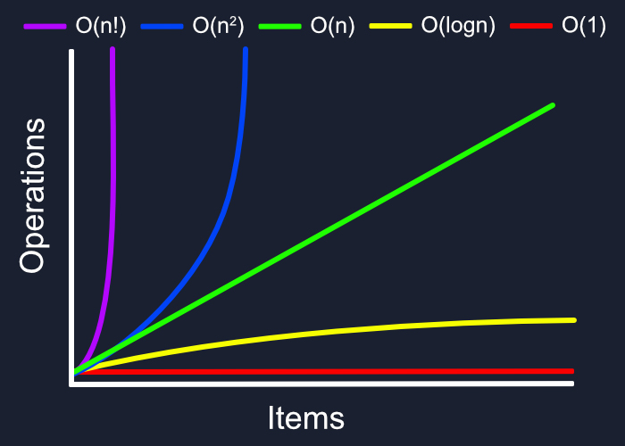


### Algoritmo de Dijkstra:

* **Complejidad Temporal O(N^2)**: Al estar implementado mediante la búsqueda lineal del nodo mínimo sobre un arreglo unidimensional de tamaño V (vértices), el proceso requiere inspeccionar todos los nodos restantes en cada iteración. Es ideal y altamente eficiente para grafos densos.

* **Complejidad Espacial O(N):** Las estructuras de soporte auxiliares (distancias, visitados, predecesores) consumen memoria de forma lineal respecto al número de nodos, garantizando un impacto mínimo en la memoria RAM.

### Algoritmo de Floyd-Warshall:

* **Complejidad Temporal O(N^3):** Determinada de manera estricta por sus tres bucles anidados que recorren la totalidad de los vértices del grafo. Al ser un costo cúbico fijo, procesa de forma masiva miles de combinaciones en milisegundos para redes convencionales.

* **Complejidad Espacial O(N^2):** Requiere el almacenamiento en memoria de dos matrices bidimensionales completas de tamaño V×V (una para el control de distancias y otra para el mapa tridimensional de predecesores intermedios).

------------------------------------------------------------------
## 6. Pruebas de Escritorio

A continuación, se presentan los escenarios de prueba ejecutados para validar la robustez del programa, incluyendo su capacidad para detectar fallos lógicos y validar la presicion de los algoritmos.

### Prueba 1:
* **Objetivo:** Comprobar la correcta funcionalidad del algoritmo de Dijkstra.


* **Representación Gráfica de la Red:**

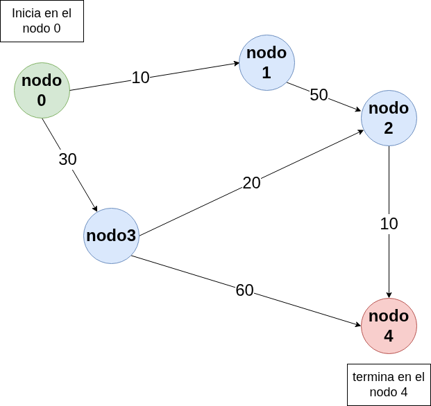

* **Entrada (`grafo_5nodos.txt`):**
```text
5
0,1,10
0,3,30
1,2,50
2,4,10
3,2,20
3,4,60
```

* **Salida con Dijkstra:**
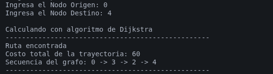

* **Salida con Floyd:**
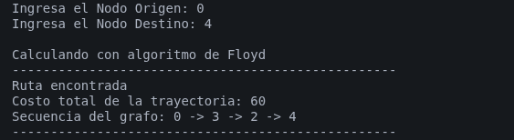

--------------------------------------------------------------------------

### Prueba 2: 8 nodos

* **Objetivo:** Evaluar el comportamiento de los motores algorítmicos ante un escenario complejo con múltiples rutas cruzadas diseñadas para forzar la actualización repetida de predecesores.

* **Representación Gráfica de la Red:**

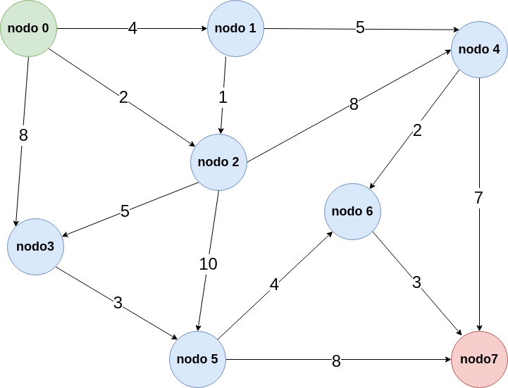

* **Entrada proporcionada (`grafo_complejo.txt`):**
```text
8
0,1,4
0,2,2
0,3,8
1,4,5
1,2,1
2,4,8
2,5,10
2,3,5
3,5,3
4,7,7
4,6,2
5,7,8
5,6,4
6,7,3
```
* **Salida con Dijkstra:**
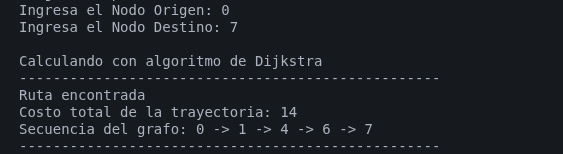

* **Salida con Floyd:**
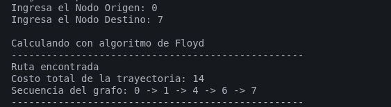

----------------------------------------------------------------------

### Prueba 3: 10 nodos

* **Objetivo:** Validar la escalabilidad y consistencia de ambos algoritmos al operar sobre una red extensa de 10 nodos con ramificaciones alternas de alto y bajo costo.

* **Representación Gráfica de la Red:**

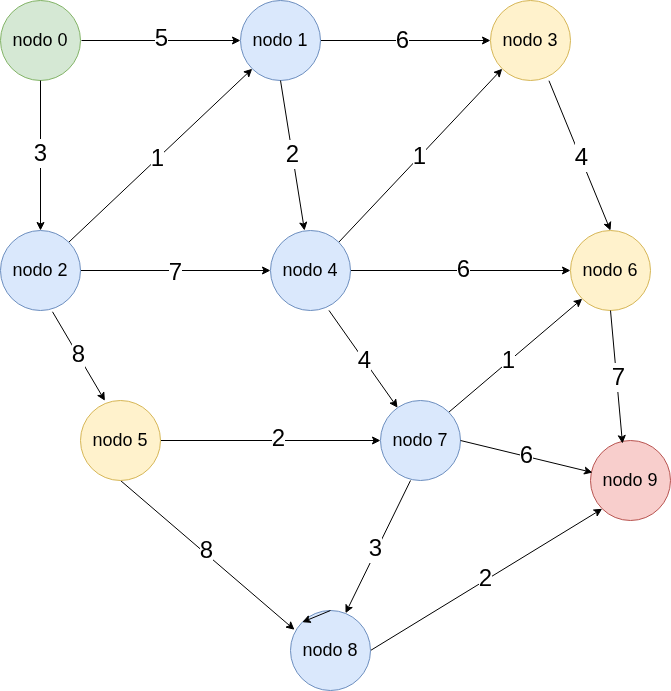


* **Entrada proporcionada (`grafo_10nodos.txt`):**
```text
10
0,1,5
0,2,3
1,3,6
1,4,2
2,1,1
2,4,7
2,5,8
3,6,4
4,3,1
4,6,6
4,7,4
5,7,2
5,8,8
6,9,7
7,6,1
7,8,3
7,9,6
8,9,2
```
* **Salida con Dijkstra:**

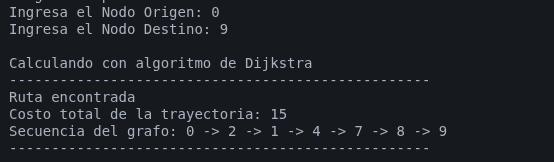

* **Salida con Floyd:**

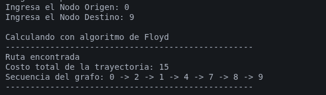

-------------------------------------------------------------------

### Prueba 4: Grafo vacio (Sin Conexiones)

* **Objetivo:** Verificar la estabilidad del sistema al procesar un archivo estructurado que define la existencia de nodos pero carece en su totalidad de aristas (conexiones), garantizando que los motores algorítmicos dictaminen la inalcanzabilidad de forma inmediata sin generar excepciones de puntero nulo (*NullPointerException*) o bucles infinitos.

* **Representación Gráfica de la Red:**

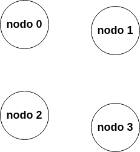

* **Entrada proporcionada (`grafo_4nodos_vacio.txt`):**
```text
4
```

(Nota: El archivo solo contiene el número 4 en la primera línea, especificando que existen 4 nodos [0, 1, 2, 3], pero no se declara ninguna línea subsecuente de conexiones).


* **Comportamiento del Código:** El LectorGrafo procesa la primera línea, instancia el objeto Grafo(4) e inicializa la matriz de adyacencia de 4×4. Al no encontrar más líneas, todas las celdas fuera de la diagonal principal conservan de forma nativa el peso de INFINITO (99999999). Al solicitar una ruta de 0 a 3, tanto Dijkstra como Floyd-Warshall inspeccionan la matriz, evalúan el costo inicial y abortan el cálculo al detectar el valor infinito de control.

* **Evidencia de Ejecución / Salida Esperada con Dijkstra:**

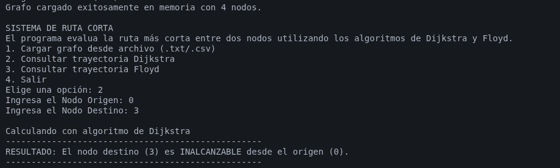


* **Evidencia de Ejecución / Salida Esperada con Floyd:**

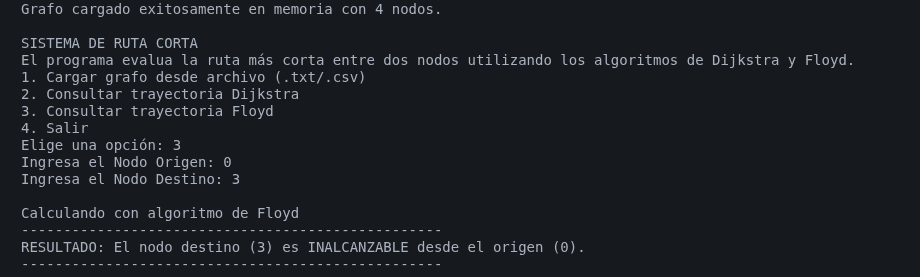

----------------------------------------------------------------------

### Prueba 5: Validación de Archivos Corruptos

* **Objetivo:** Demostrar estabilidad de la aplicación (específicamente de las capas `services` y `ui`) al enfrentarse a entradas de datos malformadas, tales como la inclusión de caracteres alfabéticos, símbolos o líneas incompletas, tanto dentro de los archivos de texto como en la interacción por consola, garantizando que el programa intercepte el error de forma controlada sin colapsar.

* **Entrada proporcionada en Archivo Corrupto (`grafo_corrupto.txt`):**

```text
5
0,1,10
0,dos,30
1,2
3,4,15
```
(Nota: La línea 3 contiene una cadena de texto ["dos"] en lugar de un entero numérico, y la línea 4 carece del dato del peso de la arista, teniendo solo dos parámetros en lugar de tres).

* **Comportamiento del Código:** 1. Robustez del consumo de archivos: La clase LectorGrafo procesa la línea estructuralmente correcta 0,1,10. Al llegar a la línea 3, el método Integer.parseInt() detecta la cadena de texto y dispara de forma nativa un NumberFormatException. El bloque catch del servicio captura la excepción, imprime una advertencia con el número de línea exacto y continúa con la lectura sin detener el programa. Al evaluar la línea 4, el condicional de validación estructural if (partes.length == 3) detecta que la línea está incompleta, imprimiendo una alerta y descartándola de la memoria de forma segura.
Robustez en la Interacción del Menú: Si tras cargar un grafo el usuario solicita calcular una trayectoria e introduce caracteres alfabéticos por teclado en lugar de números de nodo (ej. Origen: 0, Destino: X), el bloque try-catch implementado en el método ejecutarAlgoritmo de MenuConsola.java intercepta el fallo de casteo, despliega un mensaje amigable de error y limpia los buffers para retornar al usuario al menú raíz de forma segura.

* **Evidencia de Ejecución / Salida Esperada en Terminal:**

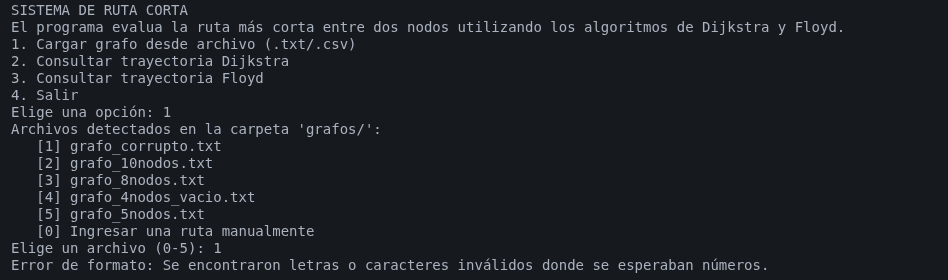

**con el ingreso de caracteres inesperados:**

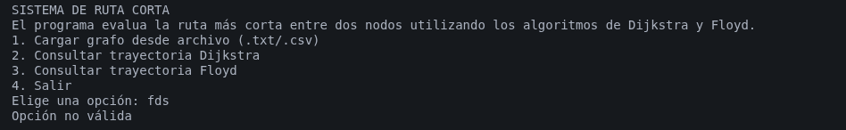

**consultar una ruta con un origen y un destino inexistente:**

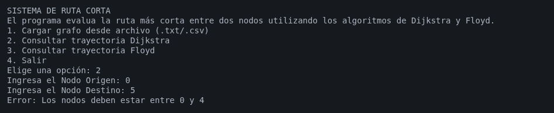


--------------------------------------------------------------------
## 7. Arquitectura de Directorios

El proyecto se estructuró bajo un patrón modular por capas desacoplado, organizando las responsabilidades de la siguiente manera dentro del directorio **src/**:

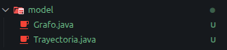


* **com.proyecto.grafos.model:**  Contiene las clases estructurales puras de la aplicación. **Grafo.java** resguarda de manera hermética la matriz bidimensional bajo atributos de acceso privado (private), forzando a que cualquier cambio se realice de forma controlada. **Trayectoria.java** funciona como el contenedor inmutable de resultados.
------------------------------------------
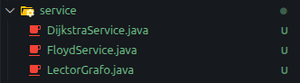


* **com.proyecto.grafos.service:** Aloja los motores algorítmicos y utilidades de parsing. **DijkstraService.java** y **FloydService.java** operan de forma puramente agnóstica; no conocen de dónde provienen los datos ni cómo se van a mostrar. Reciben objetos tipo Grafo y devuelven Trayectoria. En esta capa se ubica **LectorGrafo.java**, encargado de parsear el texto y aplicar reglas de validación estructural.
-----------------------------------------------------

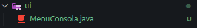
* **com.proyecto.grafos.ui:** Representada por **MenuConsola.java.** Centraliza toda la interacción con el flujo de entrada por teclado y la impresión de menús. Es la única capa autorizada para interactuar con el usuario. Si el día de mañana se requiere migrar a una interfaz visual de escritorio o web, solo se debe reemplazar esta capa sin tocar una sola línea de código de los servicios matemáticos.
----------------------------------------------------


* **com.proyecto.grafos:** Contiene a Main.java, cuya única función es iniciar la ejecución del ciclo de vida de la aplicación.

---------------------------------------------------------------
## 8. Conclusiones

Con este proyecto me demostre que la teoría se puede aplicar en la programación para resolver problemas del mundo real, como encontrar la ruta más rápida y económica en un mapa, asi como encontar las rutas con menor latencia en una red de maquina. Además de  organizar el código de forma ordenada y por secciones separadas me permitió crear un programa limpio, fácil de entender, facil de mantener y  resistente a errores cuando se introducen datos equivocados.
---------------------------------------------------------------
## 9. Fuentes

https://es.wikipedia.org/wiki/Algoritmo_de_Dijkstra

https://es.wikipedia.org/wiki/Algoritmo_de_Floyd-Warshall

https://www.undefinedworld.com/blog/analisis-de-algoritmos